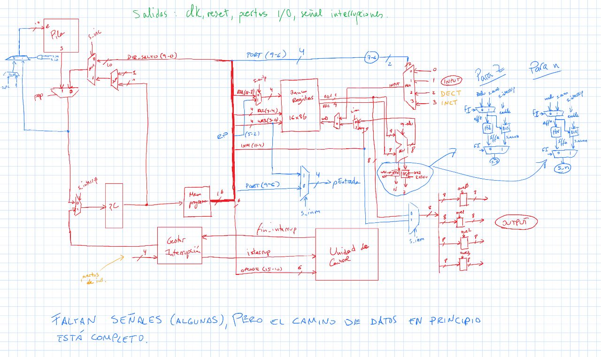
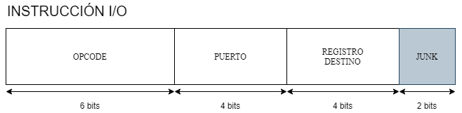
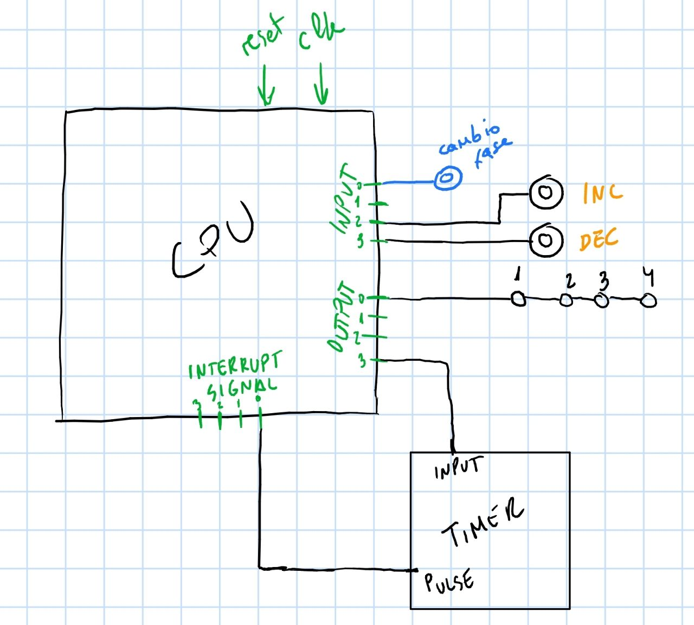
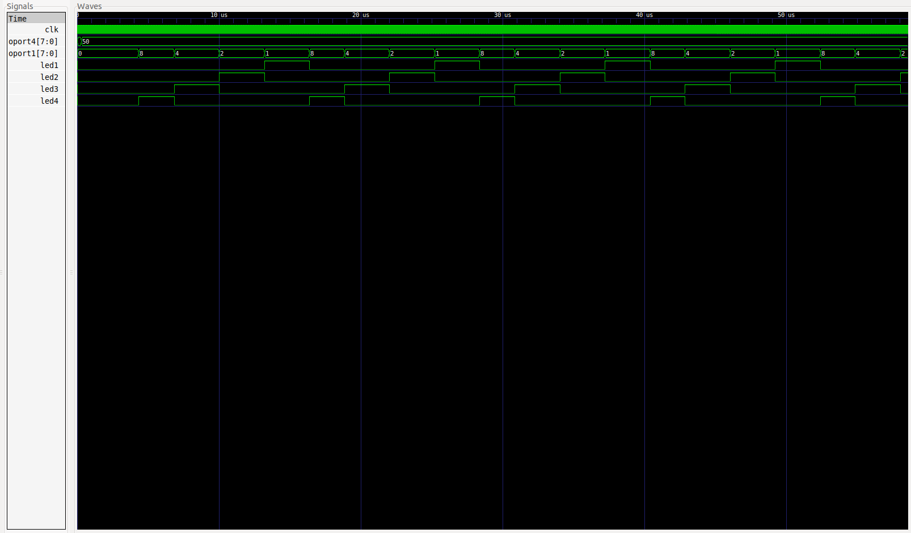
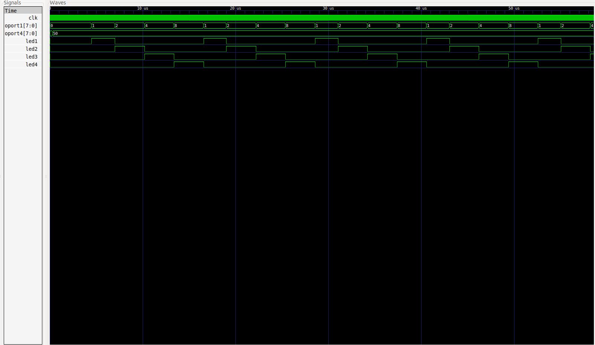
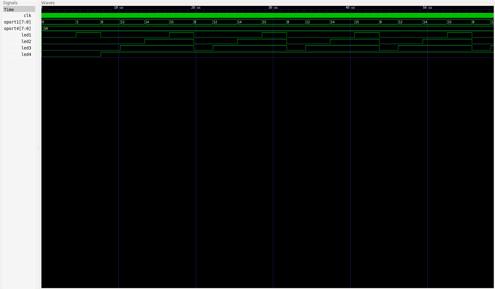
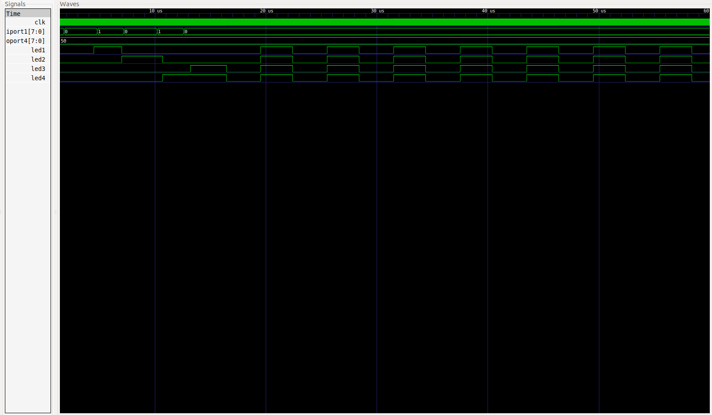
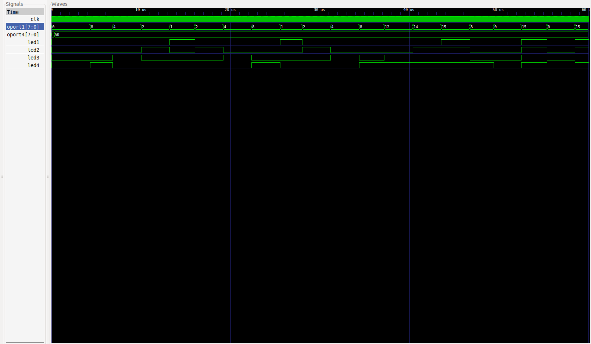

# PRÁCTICA 3: Comunicación de la CPU con dispositivos entrada/salida

## Índice

1. [Objetivo](#objetivo)
2. [Mejoras](#mejoras)
3. [Problemas encontrados](#problemas)
4. [Compilación](#compilacion)
5. [Funcionamiento del compilador](#compilador)
5. [Formato de palabra](#formatoPalabra)
6. [Instrucciones Implementadas](#microInstrucciones)
7. [Ejemplo del funcionamiento de la CPU monociclo base](#funcionamientoCPU)
8. [Ejemplo del funcionamiento de la CPU con E/S](#funcionamientoCPUes)

## Objetivo<a name="objetivo"></a>

El objetivo de esta práctica es desarrollar una CPU básica monociclo, e implementarse mejoras a la misma. En concreto, esta CPU posee las siguientes características:

- Tiene una palabra de 16 bits (2 Bytes).

- Posee una memoria de programa con un máximo de 1024 instrucciones. Esto implica que el programa que se desee ejecutar debe tener un máximo de 1024 instrucciones.

En este repositorio se encuentra una versión mejorada de la inicial CPU monociclo, en la que se implementa E/S, gestión de interrupciones y un timer programable.

- El camino de datos de esta CPU es el siguiente:



## Mejoras<a name="mejoras"></a>

Estas son las mejoras que se han logrado implementar en este proyecto:

- Pila: Se ha dispuesto una pila exclusiva para realizar subrutinas. De esta forma, esta pila interna en la CPU es capaz de guardar la posición siguiente en la dirección del PC con el objetivo de recuperarla posteriormente. Para ello, se dispone de dos nuevas instrucciones: `PUSH` y `POP`. Pese a pertenecer a la codificación de los saltos, estas instrucciones no requieren de ningún dato adicional más all
á del OPCODE. Aquí disponemos una imagen con detalles sobre la implementación de la misma:


- Implementadas instrucciones `SKZ` y `SKNZ`. Estas instrucciones se encargan sencillamente de saltarse la siguiente instrucción del programa si se cumple la condición. Pertenece a la rama de las instrucciones de salto.

- Creado compilador para interpretar instrucciones utilizando etiquetas. Por ejemplo, la instrucción `LOAD 7 R1` el compilador la traduce a `1000_0000_0111_0001`. Además, tiene soporte para pseudo-instrucciones, de tal manera que la instrucción `BEQ R1 R2 DIR` se traduce como las instrucciones `SUB R1 R2 R0` y `JZ DIR`. La lista de pseudo-instrucciones implementadas en el compilador se incluyen en el apartado [Instrucciones implementadas](#microInstrucciones). Para que la CPU sea capaz de ejecutar el programa es necesario que el fichero se coloque en el directorio raíz con el nombre `progfile.dat`. Para ejecutar el compilador, use el siguiente comando en el directorio raíz del proyecto:

```bash

	./compilar program.as progfile.dat

```

- Se ha creado un compilador para producir subrutinas. Más detalles en [Funcionamiento del Compilador](#compilador)

- El compilador ahora soporta etiquetas para facilitarnos los saltos en el programa.

- Añadido flag que informa a la UC de que el resultado de la última operación de la ALU ha dado un valor negativo. Con esto, también se implementa la diferenciación de operaciones aritméticas en binario puro y en complemento a dos.

- Implementada instrucción JN, que habilita un salto a la dirección indicada si el flag de negativo está activo.

- Añadida pseudo-instrucciones `GOTO` y `RETURN` para ir a una subrutina y volver de ella respectivamente. Hacen uso de la pila para su funcionamiento.

- Implementada E/S para la CPU, con dos nuevas instrucciones, `IN` y `OUT`, para la comunicación con los puertos de E/S. Solo se dispone de 4 puertos de entrada y 4 puertos de salida. Más información sobre las instrucciones en el apartado de [Instrucciones Implementadas](#microInstrucciones).

- Implementado un timer que nos permite contar varios ciclos de reloj.

## Problemas encontrados<a name="problemas"></a>

- La E/S me ha costado un poco entenderla e implementarla, a pesar de ser muy fácil al final. Uno de los problemas que tiene actualmente la E/S es que, si la primera instrucción del programa es una operación E/S, esta no se produce correctamente, dando pequeños problemas. Hasta ahora, para solucionarlo, tenemos que añadir una operación inútil (como ADD R0 R0 R0) para perder ese primer ciclo de reloj y así poder corregir el problema. Plateo añadir la instrucción NOP al repertorio, que no hace nada. De esta forma, podmeos perder un ciclo de reloj.

- La gestión de interrupciones inicialmente me dió muchos problemas. Los saltos condicionales en primer lugar hacen una operación de la ALU para activar un flag, y en la siguiente operación comprueban dicho flag y saltan si procede. Es posible, y de hecho ha ocurrido en varios casos, que la interrupcion se active justo entre estas dos operaciones, de modo que si la subrutina que se ejecuta para reaccionar a la interrupción ejecuta una operación de la ALU este flag se podría ver alterado. El resultadoes que el al volver de la subrutina el salto haría un comportamiento inesperado.

La solución fue sencillamente implementar registros auxiliares para los flags. De esta forma, al saltar a una interrupción los flags se almacenan en los registros auxiliares, y los recupera al volver de la subrutina.

- Otro problema que tuve fue a la hora de volver de la subrutina de interrupción. Cuando interrumpía justo antes de que se resolviera el salto, como inicialmente guardaba en la pila el valor siguiente a la instrucción actual, el salto no se ejecutaba si esa era la intención. La solución resultó en comprobar si la instrucción de salto iba a tener éxito (mirando la señal `s_inc`) y en caso afirmativo enviar a la pila el valor de `e_pc` en lugar de `s_pc + 1`.

## Compilación<a name="compilacion"></a>

Para compilar el proyecto, se debe situar la terminal en la raíz del mismo y ejecutar el siguiente comando:

```bash

	iverilog -c datafiles.txt -o cpu.out cpu_tb.v cpu.v

```

El fichero `datafiles.txt` contiene una lista de los ficheros `.v` necesarios para la correcta compilación del programa.

Este comando compilará el proyecto y generará el fichero `cpu.out`. Para poder ejecutar el fichero y ver el resultado con GTKWave, hacemos uso del comando `vvp cpu.out`. Esto generará el fichero `cpu_tb.vcd` el cual podemos utilizar para ver la ejecución de la CPU en GTKWave con el comando `gtkwave cpu_tb.vcd`.

Para poner a prueba esta CPU monociclo, **el programa debe ser escrito en el fichero progfile.dat**, en binario y siguiendo el formato de palabra indicado.

## Funcionamiento del Compilador<a name="compilador"></a>

El compilador para convertir el código en ensamblador en código binario, contiene dos ejecutables: `compilador2.py` y `compilador2-subrutina.py`.

El primero nos permite compilar el programa principal añadiendo, si existen, las 4 subrutinas del gestor de interrupciones (o llenar de 0 en caso contrario). Los ficheros que revisa el compilador para incluir las subrutinas son `subrutina1.as`, `subrutina2.as`, `subrutina3.as` y `subrutina4.as`. Estos ficheros deben ser colocados en el mismo directorio que el compilador. Si alguno de esos ficheros no los encuentra (por ejemplo, no queremos implementar una subrutina para la línea de interrupción 2 y por tanto no creamos el fichero) el programa lo sustituye con 0's.

El segundo programa nos permite compilar subrutinas, que se tratan de forma especial. Tenemos varios tipos de subrutinas.

```bash

	$ ./compilador2-subrutina.py [1/2/3/4] <fichero.as> <fichero.dat>

```

Esta forma nos permite crear una de las 4 subrutinas de las líneas de interrupción. El contenido que genere este programa (que se incluye en fichero.dat) si el fichero tiene el nombre adecuado se incluirá en la posición que le corresponda del fichero `progfile.dat` cuando se compile el programa principal.

```bash

	$ ./compilador2-subrutina.py 0 <fichero.as> <fichero.dat> <posicion_en_memoria>

```

Esta opción crea una subrutina (función) que comienza en la línea de código especificada en la opción `<posicion_en_memoria>`. El código generado por el compilador de subrutinas se debe colocar a mano en la posición de memoria deseada, en el fichero `progfile.dat`.

## Formato de instruccion<a name="formatoPalabra"></a>

Como se ha mencionado antes, esta CPU es capaz de trabajar con un máximo de 64 instrucciones. El formato para cada instrucción es el siguiente:

- Instrucciones para saltos:


Estas instrucciones corresponden a los OPCODE que empiezan por 11 (16 instrucciones).

- Instrucciones inmediatas


Estas instruciones empiezan por 100 (2 instrucciones).

- Instrucciones I/O



Son aquellas instrucciones cuyos OPCODE empiezan por 101 (8 instrucciones).

- Instrucciones para operaciones aritmético-lógica.


Estas instrucciones empienzan por 0 (8 instrucciones).

## Instrucciones implementadas<a name="microInstrucciones"></a>

Las instrucciones implementadas actualmente se representan en la siguiente tabla:

### Instrucciones inmediatas
| INSTRUCCIÓN      | OPCODE | DESCRIPCIÓN                                                                                                 |
| :--------------: | :----: | :---------------------------------------------------------------------------------------------------------- |
| **LOAD**         | 1000   | Carga un determinado valor en un registro                                                                   |
| **OUTI**         | 1001   | Manda al puerto de salida indicado en el apartado de registro (últimos 4 bits) el valor inmediato indicado  |

### Instrucciones de I/O
| INSTRUCCIÓN      | OPCODE   | DESCRIPCIÓN                                                                                                 |
| :--------------: | :------: | :---------------------------------------------------------------------------------------------------------- |
| **OUT**          | 101000   | Manda al puerto de salida el valor contenido en un registro                                                 |
| **IN**           | 101001   | Envía el dato recibido por el puerto de entrada a un registro                                               |
| **??**           | 101010   | ??                                                                                                          |
| **??**           | 101011   | ??                                                                                                          |
| **??**           | 101100   | ??                                                                                                          |
| **??**           | 101101   | ??                                                                                                          |
| **??**           | 101110   | ??                                                                                                          |
| **??**           | 101111   | ??                                                                                                          |

### Instrucciones de salto
| INSTRUCCIÓN      | OPCODE | DESCRIPCIÓN                                                                             |
| :--------------: | :----: | :-------------------------------------------------------------------------------------- |
| **J**            | 110000 | Salto incondicional                                                                     |
| **JZ**           | 110001 | Salto si el flag de 0 está activo                                                       |
| **JNZ**          | 110010 | Salto si el flag de 0 **no** está activo                                                |
| **JN**           | 110011 | Salto si el flag de negativo está activo                                                |
| **LINK**         | 110100 | Envía el valor siguiente de PC a la pila y salta a la dirección especificada            |
| **RETURN**       | 110101 | Recupera el último dato ingresado y lo pone en PC                                       |
| **SKZ**          | 110110 | Se salta la siguiente instrucción del programa si el flag de Z está activo              |
| **SKNZ**         | 110111 | Se salta la siguiente instrucción del programa si el flag de Z **no** está activo       |
| **FREE**         | 111000 | Instruccion para terminar una interrupción                                              |
| **??**           | 111001 | ??                                                                                      |
| **??**           | 111010 | ??                                                                                      |
| **??**           | 111011 | ??                                                                                      |
| **??**           | 111100 | ??                                                                                      |
| **??**           | 111101 | ??                                                                                      |
| **??**           | 111110 | ??                                                                                      |
| **??**           | 111111 | ??                                                                                      |

### Instrucciones aritmético-lógicas
| INSTRUCCIÓN      | OPCODE | DESCRIPCIÓN                               |
| :--------------: | :----: | :---------------------------------------- |
| **ADD**          | 0010   | Suma                                      |
| **SUB**          | 0011   | Resta                                     |
| **AND**          | 0100   | Operación AND entre los bits              |
| **OR**           | 0101   | Operación OR entre los bits               |
| **NOT**          | 0001   | Niega los bits del valor introducido      |
| **SELF**         | 0000   | Devuelve el mismo valor que el de entrada |
| **NFOP**         | 0110   | Niega el primer operando                  |
| **NSOP**         | 0111   | Niega el segundo operando                 |

### Pseudo-Instrucciones

Para utilizar estas instrucciones se debe hacer uso del compilador proporcionado.

| PSEUDO-INSTRUCCIÓN | INSTRUCCIONES NATIVAS EQUIVALENTES       | DESCRIPCIÓN                                                             |
| :----------------: | :---------------------------------       | :---------------------------------------------------------------------- |
| **BEQ** R1 R2 DIR  | **SUB** R1 R2 R0, **JZ** DIR             | Si los datos en R1 y en R2 son iguales, salta a la dirección DIR        |
| **BNE** R1 R2 DIR  | **SUB** R1 R2 R0, **JNZ** DIR            | Si los datos en R1 y en R2 **no** son iguales, salta a la dirección DIR |
| **BLT** R1 R2 DIR  | **SUB** R1 R2 R0, **JN** DIR             | Si el valor en R1 es menor que R2, salta a la dirección DIR             |
| **BLE** R1 R2 DIR  | **SUB** R1 R2 R0, **JN** DIR, **JZ** DIR | Si el valor en R1 es menor **o igual** que R2, salta a la dirección DIR |
| **BGT** R1 R2 DIR  | **SUB** R2 R1 R0, **JN** DIR             | Si el valor en R1 es mayor que R2, salta a la dirección DIR             |
| **BGE** R1 R2 DIR  | **SUB** R2 R1 R0, **JN** DIR, **JZ** DIR | Si el valor en R1 es mayor **o igual** que R2, salta a la direcicón DIR |

Como se puede observar, el repertorio de instrucciones de salto y de E/S puede ser ampliado.

## Ejemplo del funcionamiento de la CPU monociclo base<a name="funcionamientoCPU"></a>

Este ejemplo corresponde a la CPU base solicitada para la práctica.

El código que se ejecuta en la prueba es el siguiente:

### Código en C++
```C

	int main (void) {
		int sum = 0;

		for (int i = 0; i != 4; i++) {
			sum += (10 - i) + 1;
		}
	}

```

### Código en microinstrucciones de nuestra CPU monociclo
| DIR     | CÓDIGO CON ETIQUETAS | CÓDIGO EN BINARIO       |
| :-----: | :------------------- | :---------------------: |
| **0**   | **LOAD** 0, R1       | **1000** 0000 0000 0001 |
| **1**   | **LOAD** 10, R2      | **1000** 0000 1010 0010 |
| **2**   | **LOAD** 0, R3       | **1000** 0000 0000 0011 |
| **3**   | **LOAD** 4, R7       | **1000** 0000 0100 0111 |
| **4**   | **SUB** R2, R3, R4   | **0011** 0010 0011 0100 |
| **5**   | **LOAD** 1, R5       | **1000** 0000 0001 0101 |
| **6**   | **ADD** R4, R5, R5   | **0010** 0100 0101 0101 |
| **7**   | **ADD** R5, R1, R1   | **0010** 0101 0001 0001 |
| **8**   | **LOAD** 1, R5       | **1000** 0000 0001 0101 |
| **9**   | **ADD** R3, R5, R3   | **0010** 0011 0101 0011 |
| **10**  | **SUB** R7, R3, R8   | **0011** 0111 0011 1000 |
| **11**  | **JNZ** 4            | **1000 10**00 0000 0100 |
| **12**  | **ADD** R1, R0, R1   | **0010** 0001 0000 0001 |

**NOTAS**:
- El OPCODE viene destacado en negrita.
- La última instrucción se realiza para que el resultado de la suma se refleje en la salida de la ALU, pudiéndose ver en el GTKWave. El resultado de la variable `sum` es 38.

### Resultado del GTKWave
Como se puede observar en la captura de pantalla, se realiza un salto entre la instrucción en la dirección 11 y la 4. Esto ocurre hasta el final, en el cual acaba sumando la variable `sum` con 0, de forma que el resultado de la suma acabe en la salida de la ALU.


## Ejemplo del funcionamiento de la CPU con E/S<a name="funcionamientoCPUes"></a>

Este ejemplo ilutra  el funcionamiento de la E/S, así como el gestor de interrupciones y el timer programable. En este ejemplo se pretende simular una secuencia de encendido y apagado con leds, conectados al puerto 0 de salida. En el puerto 2 y 3 de entrada se dispone de dos botones; uno para acelerar el tiempo entre un paso y otro de la secuencia y otro para desacelerar el tiempo. Asimismo, se dispone de 4 tipos de secuencias. A saber:

- Secuencia 1: Recorrido de derecha a izquierda.
- Secuencia 2: Recorrido de izquierda a derecha.
- Secuencia 3: Acumulación de derecha a izquierda.
- Secuencia 4: Parpadeo de los leds.

Para cambiar de secuencia se dispone de un botón adicional conectado al puerto 0 de entrada.

Un timer programable recibe a través del puerto 3 de salida el número de ciclos que debe esperar entre cada señal. La señal que produce está conectada al puerto 0 del gestor de interrupciones, de forma que cada vez que se produzca señal la secuencia avanza.

Se puede observar un dibujo de cómo está conectado el sistema a la CPU en la siguiente imagen:



### Descripción del funcionamiento del programa
El programa principal se encarga sencillamente de monitorizar los botones, de tal forma que cuando se pulsen se realicen los cambios necesarios para que la acción solicitada tenga lugar. Este programa guarda en dos registros el número máximo y mínimo de ciclos que usará el timer. De esta forma se acota la velocidad a la que el timer realiza la secuencia.

El software de gestión de la línea de interrupción 0 es el encargado de avanzar la secuencia de los leds. El software en primer lugar determina qué tipo de secuencia se está ejecutando, y ejecuta una subrutina que contiene el recorrido específico de esa secuencia.

### Simulación del test de velocidad
Para comprobar que tanto el software como el hardware funcionan correctamente, se ha diseñado un testbench que realiza las siguientes acciones:

El límite de la velocidad indicado por software es entre 50 y 250.

- Se incrementa la velocidad del timer de 50 ciclos a 100 ciclos por señal.
- Tras un tiempo, la velocidad baja de 100 a 50 ciclos.
- Vuelve a disminuir la velocidad, pero como ya a alcanzado el límite, la velocidad permanece valiendo 50.

### Simulación del test de secuencias
Para testear el comportamiento del cambio se fase, se han realizado diferentes pruebas. En las cuatro primeras imágenes, se visualiza cada una de las secuencias. En la última se observa cómo las secuencias van variando.



Esta secuencia recorre de derecha a izquierda en bucle.



Esta secuencia recorre de izquierda a derecha en bucle.



Esta secuencia acumula los leds de derecha a izquierda, en bucle.



Esta secuencia realiza un parpadeo de los leds.



En esta imagen se ve cómo los recorridos cambian en función del puerto de entrada 1.


---
